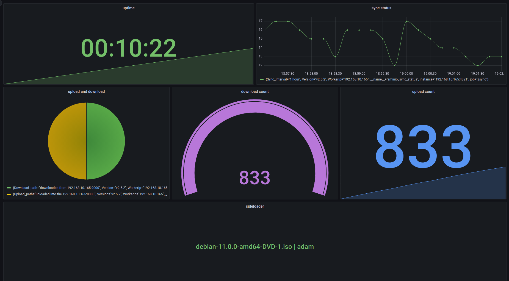

<div align="center">

[](https://go.dev/dl/) 
[](https://go.dev/dl/)
[](https://go.dev/dl/)
[](https://go.dev/dl/)
</div>


<div align="center">
 <br><br>
</div>


# zminio

this is a minio client package that allows you to these actions with your minio server.

1 ) `upload` : upload files to your minio server. ( every file you want! ) <br>
2 ) `uploadDir` : upload a directory full of multiple files to the minio. <br>
3 ) `download` : download one object or all of the objects from one bucket in minio server. <br>
4 ) `delete` : delete one object or all of the objects from one bucket in minio server. <br>
5 ) `list` : get the list of objects from one bucket in minio server. <br>
6 ) `info` : get the information of one object from minio server. <br>
7 ) `move` : move one object from one bucket to another bucket in minio server. <br>
8 ) `sync` : sync two bucket from minio server with each other. <br>
9 ) `listenDownload` : listen to the one bucket in minio server , and download every object that will be uploaded.<br>
10 ) `sideloader` : it will split large files into a specefic amount of size and transfer those base on the tcp connection.

> [!NOTE] 
> you can set the config of the minio servers from flags and .env file.

> [!NOTE] 
> you can set your prometheus server address for monitor your proccess with this flag `-pr`.

> [!NOTE] 
> This app is suppporting concurrency, and you can set the amount of workers with `-n` flag. (default = 10)

### Flags
```
      --ak string         set your minio access key
      --aks string        set your minio access key
      --all               sync all the buckets and objects
      --bs string         set your minio bucket name
  -b, --bucket string     set your minio bucket name
      --cache             use the redis as a cache for the sync proccess!
      --do string         set the job you want to do. (download, upload, move, delete, list, sync, uploadDir)
      --ds                delete the object from bucket after sync
  -u, --endpoint string   set your minio url address
      --env string        set your env file path
  -h, --help              help for zminio
  -f, --input string      set the path of the file that you wanna upload
  -i, --interval int      set the interval for sync objects (default 1)
  -l, --logger string     set app logger type , stdout or file (default "stdout")
      --ls                set the listen bucket on sync proccess!
      --mb string         set your minio bucket name that you want to move files to it
      --mincache          use the minio as a cache for the sync proccess!
      --obj string        set your minio object name
  -o, --output string     set the path of the file that you wanna download
      --pr string         run Prometheus on ip:port to monitor aminio metrics,if not set this flag prometheus disabled. (exaple:-pr 0.0.0.0:1234)
      --save              save the objects throw the sync process!
      --se                set your secure ssl option in connecting to the minio. (default false)
      --ses               set your secure ssl option in connecting to the minio. (default false)
      --sideloader        sideloader for transfer large objects over tcp connection.
      --sk string         set your minio secret key
      --sks string        set your minio secret key
  -t, --type string       set the side loader type. (server, client)
      --us string         set your minio url address
  -v, --version           zminio version
  -n, --workers int       set the count of worker for run. (default 10)
```

## Sample Commands
<strong> NOTE : </strong> you have to create .env file for set minio login data or you could pass them via the provided flags.

- upload :
```
./Zminio -f README.md --do upload --env zminio.env
```

- upload directory :
```
./Zminio -f /tmp/uploads/ --do uploadDir --env zminio.env -n 50
```
<strong>NOTE : </strong> you can set the number of workers to upload objects to the minio. (base on the source you have)

- download :
```
./Zminio --obj README.md -o /tmp/Downloads/ --do download --env zminio.env
```

- download all :
```
./Zminio --obj all -o /tmp/Downloads/ --do download --env zminio.env -n 50
```

- download listen bucket :
```
./Zminio -o /tmp/Downloads/ --do listenDownload --env zminio.env -n 10
```
<strong>NOTE : </strong> By default zminio in `listenDownload` senario, does not delete object after download. For do that you can use this flag `--ds` to delete objects after download.

- delete :
```
./Zminio --obj [object name] --do delete --env zminio.env
```

- delete all :
```
./Zminio --obj all --do delete --env zminio.env -n 50
```

- move :
```
./Zminio --do move --obj [object name] --mb MOVE_BUCKET --env zminio.env
```

- sync :
```
./Zminio --do sync --env zminio.env --ds -n 50
```
> [!NOTE] <br>
> `--ds` delete objects after sync minio's together.<br>
> for save objects into the storage while sync in happening, you can use `--save` and set the output path for download!<br>
> after sync will be finished, the app will be close. For ignore that and listen on the bucket to sync comming objects you have to use `--ls` flag.<br>
> if you want to sync all buckets and objects, you have to use `--all` flag. <br>
> in case of sync , its better to have a cahce for sync process to ignore exsited file in the destination. For doing that you should set the cache address in .env file and use `--cache` flag. <br>

- list :
```
./Zminio --do list --env zminio.env
```

- info :
```
./Zminio --do info --obj [object name] --env zminio.env
```

## Sideloader
this app will be able to create a socket between server and client over tcp, then it will communicate and transfer large files base on a protocol like FTP.

- server command :
```
./Zminio --sideloader -t server --env zminio.env
```

- client command :
```
./Zminio --sideloader -t client --env zminio.env ....
```

## ENV file
the format of .env file should be like this:
```
MINIO_ENDPOINT="localhost:9000"
MINIO_ACCESS_KEY="minioadmin"
MINIO_SECRET_KEY="minioadmin"
MINIO_BUCKET_NAME="sync"
MINIO_SSL_SECRET="false"
SYNC_MINIO_ENDPOINT="localhost:8000"
SYNC_MINIO_ACCESS_KEY="minioadmin"
SYNC_MINIO_SECRET_KEY="minioadmin"
SYNC_MINIO_BUCKET_NAME="upload"
SYNC_MINIO_SSL_SECRET="false"
REDIS_BACKEND_URL='redis://localhost:6379'
SIDELOADER_ADDRESS='0.0.0.0:3030'
SIDELOADER_SIZE='100'
SIDELOADER_MAXIMUM_SIZE_START='300'
SIDELOADER_SERVER_ADDRESS='192.168.1.1:3030'
```

> [!NOTE] 
> `SYNC_MINIO_ENDPOINT` is address that you want to copy your objects.
